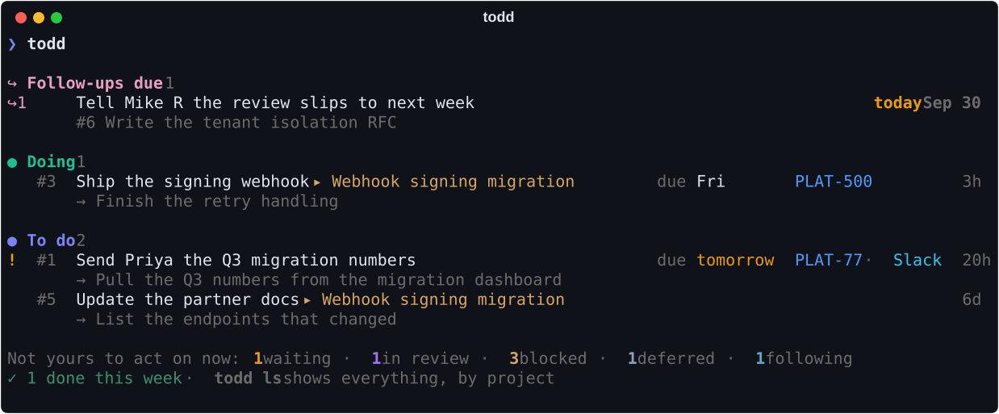
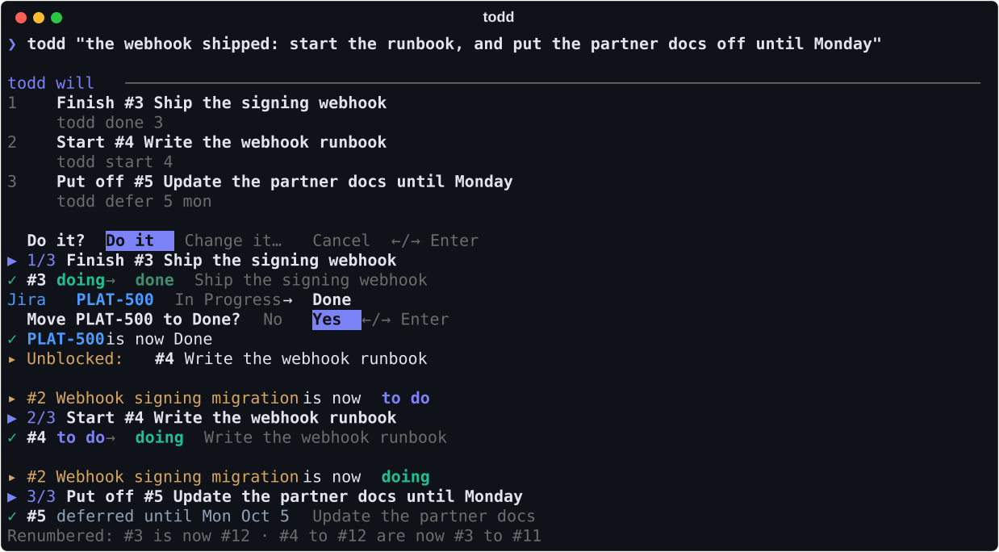
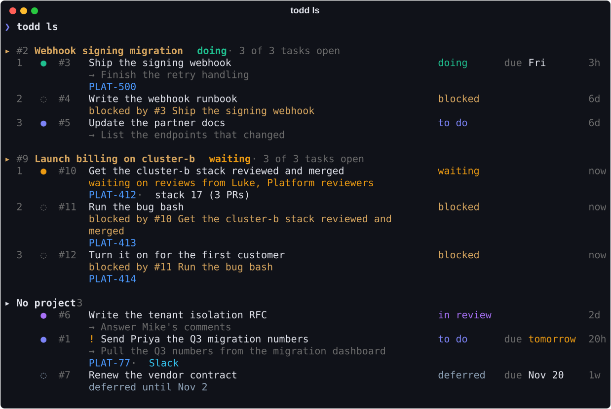

<h1 align="center">todd</h1>

<p align="center">
  <b>todd remembers.</b><br>
  Tell it what's on your plate in your own words, links and all. Claude files it, Jira stays in step, and <code>todd</code> shows what you can do right now.
</p>

<p align="center">
  <a href="https://github.com/adamtrain/todd/actions/workflows/ci.yml"></a>
  
  <a href="https://github.com/astral-sh/uv"></a>
  <a href="https://github.com/astral-sh/ruff"></a>
  <a href="LICENSE"></a>
</p>

<p align="center">
  
</p>

## Why todd

- **Say it, don't file it.** `todd "the webhook shipped, start the runbook"`. Claude works out
  which commands you mean from your actual tasks, shows you the plan, and runs it. Every command
  is still there for scripts.
- **Capture in one line.** Describe the work and paste the links: Jira keys, pull requests, Slack
  messages. Claude files it with a title, a next step, a due date, the people involved and what
  each link is for, and you see it before it's saved.
- **Only what you can act on.** `todd` leaves out what's waiting, blocked, deferred or just being
  followed, and counts it instead. `todd watch` keeps that view on screen while you work.
- **Projects that keep their own state.** Describe a chain of work and you get a project with a
  task for each part. A project is doing, waiting, blocked or done because its tasks are.
- **Jira moves when you say so.** Finishing a task offers to move its ticket, one ticket at a
  time, starting on No. Adding a task never touches Jira.
- **Promises kept.** "Tell Theo when I'm done" becomes a follow-up that comes due when the task
  is done, with an offer to draft the message.
- **Pull requests bring their context.** One link to a stacked pull request brings the whole
  stack, its reviews, and the ticket named in its title.
- **Slack without a Slack app.** todd can't read Slack, so it keeps the message you paste with
  its link, and tells you where to reply when the work is done.
- **No made-up titles.** When Claude can't tell what something is, todd asks you instead of
  inventing a vague one.

## Install

You'll need [uv](https://docs.astral.sh/uv/), plus:

- [Claude Code](https://code.claude.com), signed in. todd calls `claude -p`, so it runs on your
  Claude Code account and needs no API key.
- The [Atlassian CLI](https://developer.atlassian.com/cloud/acli/) (`acli`), signed in with
  `acli jira auth login`, for Jira.
- Optionally, the [GitHub CLI](https://cli.github.com) (`gh`), signed in, for pull requests.

```sh
uv tool install git+https://github.com/adamtrain/todd
todd doctor --claude          # checks that claude, acli and gh are ready
```

To hack on it, clone it and install it in editable mode, so changes take effect right away:

```sh
git clone https://github.com/adamtrain/todd && cd todd
uv tool install --editable .
```

## Usage

```sh
todd "remind me to send Mike the RFC draft tomorrow"    # say it; Claude picks the commands
todd add "reply to Priya re: Q3 numbers" https://example.slack.com/archives/D…/p… PLAT-412
todd                                   # what you can act on now
todd watch                             # the same, kept on screen as things change
todd ls                                # everything open, by project
todd show 12                           # links, saved messages, reviewers, follow-ups, timeline
todd start 12                          # doing        (asks about Jira → In Progress)
todd wait 12 Priya to confirm numbers  # waiting, and on what
todd defer 12 mon                      # not before Monday
todd review 12                         # in review    (asks about Jira → In Review)
todd done 12 sent the sheet            # done: Jira, follow-ups, then where to reply in Slack
todd states                            # every state and what it means
```

### Say what you want

<p align="center">
  
</p>

Anything that isn't a valid command line goes to Claude, so quotes are optional. Claude gets
every todd command (generated from the CLI itself), what each state means, and your current
tasks. It answers with real command lines, which todd checks before showing you.

- **Do it** runs the plan through the ordinary commands, with all their usual questions.
  **Change it…** takes another instruction and shows the new plan.
- A plan that only looks at things runs straight away.
- If Claude can't tell which task you mean, it asks.
- When a later command needs something an earlier one produces, like the number of a task it's
  about to add, Claude gives the commands it can and says what comes next. todd runs them and
  comes back for the rest. You're asked about each round.
- Without a terminal to ask in, a plan that changes things needs `todd do -y "…"`.

### Capturing

<p align="center">
  
</p>

Links and Jira keys can go anywhere in the arguments. todd reads what it can first (tickets
through `acli`, pull requests through `gh`), then makes one Claude call.

```sh
todd add PLAT-234 "by Friday, see also" <slack link> <slack link>
todd add "I need to complete" PLAT-123 "and tell Theo A when I'm done"
todd add "Following" <slack link> "about the ledger refactor, might end up on my plate"
todd add "renew the vendor contract, not before November 2"
todd add -e                            # write it in your editor
pbpaste | todd add                     # piped text works too
```

Before anything is saved you see what Claude would file. **Change it…** takes your correction in
plain words ("make it high priority and call it …"), as often as you like. **Leave it in the
inbox** keeps the capture for `todd triage` later. `-y` skips the preview.

**Slack messages.** For a Slack link, todd asks you to paste the message (Enter to skip, Ctrl-D
to finish), or takes it from `-q "…"`. In the editor or piped text, whatever sits under a link
is that link's text. Slack links are context unless you say where you'll reply: `--reply-in
<link>` when adding, or `todd role 12 3 reply` afterwards.

**Pull requests.** A pull request in one of GitHub's native stacks brings every pull request in
the stack, filed as one piece of work. A title with a Jira key in parentheses, like `(PLAT-412)
Move the workers` or `fix(PLAT-412): …`, brings that ticket too, if Jira can read it or its
project is listed under `[jira] keys`.

### What you see

`todd` (or `todd now`) is what you can act on: follow-ups that are due, what you're doing,
what's to do and neither blocked nor deferred, and anything not filed yet. Each task names its
project. The rest is counted underneath.

`todd watch` keeps that view on screen and redraws it whenever anything changes, so one terminal
can show the tasks at hand while you work in another. It only looks; Ctrl-C stops it.

`todd ls` is everything open: each project with its state and its tasks in order, then the tasks
that aren't in a project.

<p align="center">
  
</p>

`--following` adds what you're following, `--all` adds what's done or dropped, and `--area` and
`--person` narrow it (on `now` and `watch` too). Lists use the full width of your terminal and
wrap rather than cut anything off.

### States

`todd states` prints this, with more detail:

| State | Meaning |
| --- | --- |
| `inbox` | Captured but not filed by Claude yet. |
| `todo` | Yours to do, not started. |
| `doing` | You're working on it. |
| `waiting` | You've done your part and are waiting on someone or something. |
| `in_review` | Your work is done and out for review. |
| `done` | Finished. |
| `dropped` | Not doing it after all. |
| `following` | Not yours (yet): something you're keeping an eye on. |

`start`, `wait`, `review`, `done`, `drop`, `follow` and `reopen` move a task, and `todd move 12
waiting` goes from any state to any other. Each takes a note (`todd done 12 shipped it`). Three
things sit beside the states:

- **Blocked.** A task is blocked while any task it waits on is still open. Tasks usually follow
  one another, but several can wait on the same one, and one can wait on several:
  `todd block 16 --on 15`, `todd unblock 16`.
- **Deferred.** `todd defer 12 mon` (or `2026-11-02`, `+14`, `next week`) keeps a task out of
  `todd` until that date; `todd ls` still shows it. `todd defer 12 none` stops it, and so does
  starting the task. It's separate from a due date.
- **Following** is for things that aren't yours. A followed item is always a task of its own,
  with a check-in date, and can only become to do (`todd reopen 12`), done or dropped.

### Projects

A project is work you move forward through one or more tasks. Describe the chain in one capture,
as in the picture above, and Claude files the project and its tasks, each with its own links.

- **A project's state is never set by hand.** It's doing if any task is under way; otherwise in
  review, to do, then waiting, among the tasks that could be worked on. It's deferred when all of
  those are deferred (until the soonest of their dates), blocked when every open task waits on
  another, and done when all its tasks are done.
- **The only thing you do to a project itself is drop it** (`todd drop 7`), which drops its open
  tasks after asking. `todd reopen 7` brings those back.
- **A project always has at least one task.** `todd add --project "…"` makes one from something
  whose later tasks aren't clear yet. `todd add "…" --in 7` adds a task, and `todd edit 16 --in 7`
  moves one in.
- Tasks that aren't in a project are listed under **No project**.

### Follow-ups

| You say | todd keeps |
| --- | --- |
| "…and tell Theo A when I'm done" | ↪ Tell Theo A that PLAT-123 is done, due when the task is done |
| "told Mike R I'd ask him to review it this week, but it may slip" | ↪ Ask Mike R to review the RFC, due when it's in review. ↪ Tell Mike R review slips to next week, due Friday unless it's in review by then. |
| "Following <link>…" | ↪ Check in on it, due on the day you said, or two weeks out |

Follow-ups that are due show at the top of `todd`. When a task reaches the state one waits for,
todd offers to draft the message with Claude (copied to your clipboard), mark it done, or keep
it for later. A dated one that no longer matters closes itself. `todd followup` lists them all.

### Jira

Every time a state change would move a ticket, todd shows the move and asks about that ticket:

```text
  Jira PLAT-412  In Progress → Done
  Move PLAT-412 to Done?   No   Yes    ←/→ Enter
```

The highlight starts on **No**, and anything typed before the question appeared is ignored.
`-y` moves tickets without asking, `--no-jira` leaves them alone without asking, and `--local`
leaves Jira and Slack alone. Where todd can't ask (a script, a pipe), it leaves Jira alone and
says how to catch up. If Jira refuses, todd says so and prints the ticket's link.

`todd push 12` moves a task's tickets to match its state. `todd pull 12` goes the other way: it
re-reads the task's tickets and pull requests, and asks Claude what the changes mean for the
task. You see the proposal before it's applied. `todd pull` alone covers everything open.

### Numbers

Numbers are reused, so they stay small. Open things are numbered from 1 with no gaps. When you
finish or drop something, the ones after it move down, and todd says what moved:

```text
✓ #2 doing → done  Write the RFC
  Renumbered: #2 is now #5 · #3 to #5 are now #2 to #4
```

What's closed keeps a number after the open ones, most recently closed first, so `todd reopen 5`
straight afterwards undoes it. Numbers only change at the end of a command, and a request in
your own words runs every step with the numbers as they were when you asked. In a script, a
number is only good until the next command that finishes or drops something.

## Commands

| Command | What it does |
| --- | --- |
| `todd "…"` | Say what you want; Claude works out the commands. |
| `todd add "…" [links] [-q text] [-e] [-y] [--project] [--in 7] [--after 14,15]` | Capture a task or a chain of them. |
| `todd triage [id]` | File a task again, or everything in your inbox. |
| `todd link 12 <links…>` / `todd note 12 <text>` | Attach more links, or add to the timeline. |
| `todd edit 12 --title … --due fri --defer mon --priority high --area … --in 7` | Correct what Claude filed. |
| `todd role 12 3 reply` | Say what link 3 is for. |
| `todd now` / `todd watch` / `todd ls` / `todd projects` / `todd following` | Look at your work. |
| `todd show 12` / `todd links 12` / `todd open 12 [3]` | One task: everything, its bare links, or open them. |
| `todd start` / `wait` / `review` / `done` / `follow` / `drop` / `reopen` / `move` | Move a task. |
| `todd defer 12 mon` | Put a task off until a date (`none` to stop). |
| `todd block 16 --on 15` / `todd unblock 16` | Say what a task waits on. |
| `todd reply 12` / `todd push 12` / `todd pull [id]` | Reply in Slack, or bring Jira and GitHub in step. |
| `todd followup [add\|done\|drop\|snooze]` | Things you owe people. |
| `todd nick priya-n Priya` | Your name for a GitHub login, used everywhere, including by Claude. |
| `todd states` | Every state and what it means. |
| `todd config [--init] [--edit]` / `todd doctor [--claude] [--jira KEY] [--pr URL]` | Settings, and a check of the tools todd uses. |

`todd <command> --help` has the details.

## Configuration

`todd config --init` writes `~/.config/todd/config.toml` with every setting commented out. The
ones you're most likely to want:

```toml
[jira]
site = "example.atlassian.net"   # so bare keys like PLAT-412 become links
keys = ["PLAT", "OPS"]           # project keys to spot inside your task text

# The Jira status a ticket moves to when its task enters each state.
[jira.status]
doing = "In Progress"
in_review = "In Review"
done = "Done"

# Projects with another workflow can override any state; "" leaves Jira alone.
[jira.projects.OPS.status]
in_review = ""
done = "Closed"

# Areas of work Claude should file tasks under.
[areas]
platform = "Infrastructure, CI, migrations"
hiring = "Interviews, debriefs, hiring loops"
```

`[claude]` takes `model`, `effort` (default `low`), `timeout` and extra `args` for `claude -p`.
`[slack]` controls whether todd asks for message text and which states offer to reply.
`[following] check_in_days` (default 14) sets when to check back on something you follow.

| | Default | Override |
| --- | --- | --- |
| Tasks | `~/.config/todd/todd.sqlite` | `--db` or `$TODD_DB` |
| Settings | `~/.config/todd/config.toml` | `--config` or `$TODD_CONFIG` |
| Nicknames | `nicknames.toml` beside the settings | |

`$XDG_CONFIG_HOME` is respected.

## How it works

todd keeps everything in one SQLite file and talks to the outside through three command-line
tools you already have set up. `acli` reads tickets and moves them. `gh` reads pull requests,
with one GraphQL query for a whole stack. `claude -p` does the thinking, with tools turned off
and a JSON schema for the answer, so each filing, plan or update is a single structured call.

Claude never changes anything itself. A filing is shown to you before it's saved, and a request
in your own words becomes ordinary todd command lines that todd checks, shows you, and then runs
through the same code as if you'd typed them.

## Development

```sh
uv run pytest
uv run ruff check && uv run ruff format --check
uv run ty check
uv run scripts/screenshots.py   # regenerate docs/*.svg
```

The tests never reach Jira, Slack, GitHub or Claude. `tests/conftest.py` stands in for every
program todd runs, using made-up fixtures in the shapes the real tools return. The screenshots
come from the same stand-ins: todd's real commands, run against sample data. For checks against
the real tools, see [docs/field-tests.md](docs/field-tests.md).

```
src/todd/
├── cli.py        # the commands
├── intent.py     # a request in your own words, as todd commands
├── triage.py     # looking up links and having Claude file a capture
├── pull.py       # bringing a task up to date with its links
├── effects.py    # what follows a move: Jira, follow-ups, Slack
├── store.py      # the database, and keeping numbers low
├── models.py     # tasks, projects, links, follow-ups
├── render.py     # everything you see
├── jira.py  github.py  claude.py   # the tools todd runs
└── glossary.py   # what todd's words mean, for you and for Claude
```

## License

[CC0 1.0](LICENSE). todd is dedicated to the public domain.

todd is an independent project and isn't affiliated with or endorsed by Anthropic, Atlassian,
GitHub or Slack.
